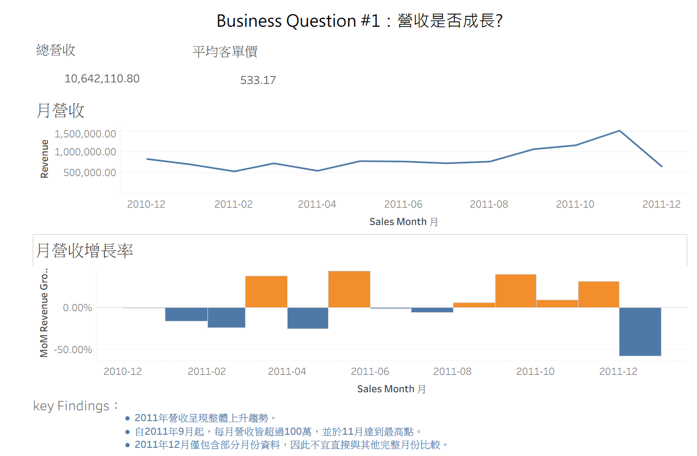
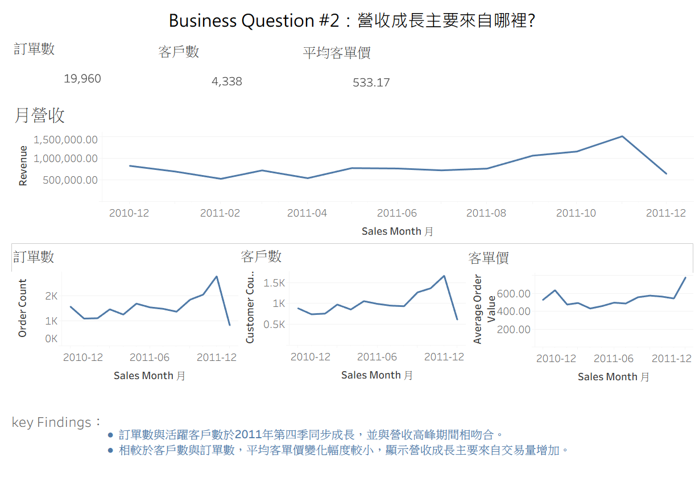

# E-Commerce Revenue Analysis Dashboard

## 專案簡介

本專案以 Online Retail Dataset 為基礎，透過 Python 進行資料清理、MySQL 進行資料分析，並使用 Tableau 建立營運分析儀表板。

分析期間：

- 2010-12-01 ~ 2011-12-09
- 524,878 筆有效交易資料

---

## 使用技術

- Python
- Pandas
- MySQL
- Docker
- Tableau

---

## 分析流程

```text
Raw Data
    ↓
Data Profiling
    ↓
Data Cleaning
    ↓
MySQL
    ↓
SQL Analysis
    ↓
Tableau Dashboard
```

---

## Business Question #1

### 營收是否成長？

### Key Findings

- 2011年營收呈現整體上升趨勢。
- 自2011年9月起，每月營收皆超過100萬，並於11月達到最高點。
- 2011年12月僅包含部分月份資料，不宜直接與其他月份比較。

### Dashboard



### 營收成長主要來自哪裡？

### Key Findings

- 訂單數與活躍客戶數於2011年第四季同步上升，其趨勢與營收成長方向一致。
- 相較於客戶數與訂單數，平均客單價變化幅度較小，顯示營收成長主要來自交易量增加。

### Dashboard



---

## Tableau Public

👉 [TableauPublic網址](https://public.tableau.com/app/profile/.71605013/viz/_17911855915590/sheet10)

---

## 專案成果

- 建立完整資料分析流程
- 完成營收成長分析
- 識別營收成長驅動因素
- 建立 Tableau 商業分析儀表板

---

## 後續規劃

- Product Analysis
- Customer Analysis
- Power BI Dashboard